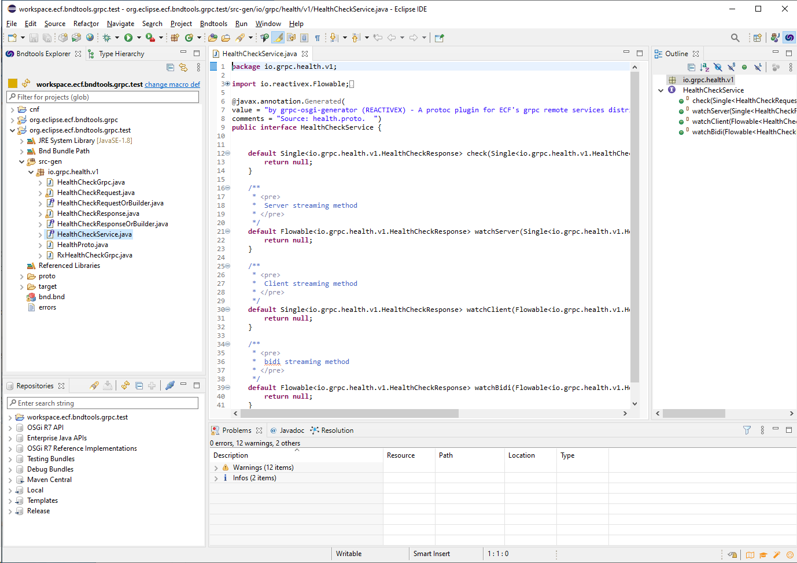

# bndtools.grpc
# Bndtools support for gRPC (Google RPC) generation of OSGi Services

This repo defines a plugin for bndtools 5.x that will:

- Generate [gRPC (Google RPC)](https://grpc.io/) java classes that may be used as the API for an OSGi Service or OSGi Remote Service.
- Initiate the code generation as part of the relatively new [bndtools -generate support](https://bnd.bndtools.org/instructions/generate.html), which will do the code generation as part of the Eclipse auto-or-user-controlled bndtools builds.

## Simplified Developer Workflow for generating gRPC Services as OSGi Services 

1. Create a proto file, with a service declaration [service declaration](https://developers.google.com/protocol-buffers/docs/proto3#services) and any protocol buffers declarations needed for request types and/or response types [proto3 syntax](https://developers.google.com/protocol-buffers/docs/proto3).

2.  Add the proto file to a bndtools bundle project and add the bndtools -generate command to the bnd.bnd project file.

When both of these are done, the bndtools -generate command will be invoked, triggering immediate java code generation for the following:

a. Classes corresponding to any/all request+response protocol buffers declarations.
b. gRPC classes generated by the gRPC compiler (for use by gRPC servers and/or clients).
c. A java interface class for each service declaration in the proto file.  This service interface can be used as the service API for OSGi services and remote services.

The code generation is completely redone when any change is made to the proto3 file, meaning that starting with a proto file a complete service API will be immediately and automatically generated, compiled, and packaged into a jar by bndtools without additional developer actions.

## Example

[org.eclipse.ecf.bndtools.grpc.test](https://github.com/ECF/bndtools.grpc/tree/master/org.eclipse.ecf.bndtools.grpc.test) is an example of the bndtools plugin project ([org.eclipse.ecf.bndtools.grpc](https://github.com/ECF/bndtools.grpc/tree/master/)).  

The example has a [health.proto](https://github.com/ECF/bndtools.grpc/blob/master/org.eclipse.ecf.bndtools.grpc.test/proto/health.proto) file, which is an enhanced version of the [grpc-java health example proto3 service](https://github.com/grpc/grpc-java/tree/master/services/src/main/proto/grpc/health/v1).  For the test project this implements part 1 of the above-described developer workflow.

For part 2 of the developer workflow, the org.eclipse.ecf.bndtools.grpc.test project has the -generate command added to the [project's bnd.bnd file](https://github.com/ECF/bndtools.grpc/blob/master/org.eclipse.ecf.bndtools.grpc.test/bnd.bnd) project file.

Here is a the test project's generate command 

```
-generate \
    proto; \
        output = src-gen; \
        generate = "org.eclipse.ecf.bndtools.grpc.GrpcGenerator -I=proto --java_out=src-gen health.proto 2>errors"
 ```
'''output = src-gen''' puts the generated code in the '''src-gen''' directory.  The '''org.eclipse.ecf.bndtools.grpc.GrpcGenerator''' is the java main class for the bndtools plugin.  '''--java_out=src-gen''' also points to the '''src-gen''' directory.  '''-I=proto''' specifies the include directory to look for proto files.  '''health.proto''' is the name of the proto source file in the proto directory.

Given the above in bnd.bnd file, the -generate command will read/parse the health.proto file and use the GrpcGenerator to generated the classes listed above.

To try this out in your local copy of Eclipse bndtools 5+ all that's needed is to setup this repo as a workspace template (via Window->Preferences->Bndtools->Workspace Templates) with new Github Repository:   '''ECF/bndtools.grpc'''

Once a new bndtools workspace is created with the org.eclipse.ecf.bndtools.grpc.test project in the new workspace, the GrpcGenerator 2ill run automatically as part of the build (assuming Eclipse's auto-build is on) resulting in the following classes in org.eclipse.ecf.bndtools.grpc.test/src-gen  



Without any other coding, this generated service may then be used to create an OSGi Remote Service by using the '''ECF gRPC Remote Service Provider''' which is the gRPC distrubtion provider for ECF's implementation of the [OSGi Remote Services standard](https://docs.osgi.org/specification/osgi.cmpn/7.0.0/service.remoteservices.html).  A remote service example with the health.proto generated service exists [here](https://github.com/ECF/grpc-RemoteServicesProvider/tree/master/examples).


